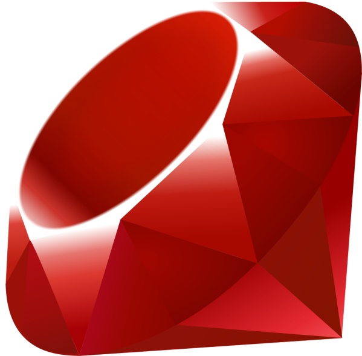

!SLIDE centereverything
<LINK REL=StyleSheet HREF="styles.css" TYPE="text/css">

# Ruby on Rails Workshop
### May 6th & 7th, 2011
#### hashtag #railsbridge

!SLIDE

## Open source workshop

#### It's a community project!
* Many individuals
* RailsBridge
* DevChix

#### All materials are open!
* DevChix wiki, RailsBridge wiki
* Slides: github, slidedown
* See github.com/railsbridge

!SLIDE centereverything
&nbsp;&nbsp;
&nbsp;&nbsp;

!SLIDE

# Why are we here?
* Learn to program for the first time
* Transition from another language
* Work better with engineers by understanding what they do
* Supplement awesome frontend skills with awesome backend skills

!SLIDE

# What is Ruby on Rails?

!SLIDE centereverything

!SLIDE

<table width="100%">
<tr>
<td align="center">

</td>
<td align="center">

</td>
</tr>
<tr>
<td>&nbsp;</td>
<td>&nbsp;</td>
</tr>
</table>
# &nbsp;
# &nbsp;

!SLIDE

<table width="100%">
<tr>
<td align="center">

</td>
<td align="center">

</td>
</tr>
<tr>
<td align="center">
Language
</td>
<td align="center">
Framework
</td>
</tr>
</table>
# &nbsp;
# &nbsp;

!SLIDE

## Ruby: programming language
* General purpose; you can use it for math, to generate music, to make charts, to scrape web pages
* Object oriented

!SLIDE

## Rails: web application framework
* Specialized piece of code for building websites
* Written in Ruby
* Open source

!SLIDE
## The Rails Philosophy
* Opinionated
* Convention over configuration
* DRY (Don't Repeat Yourself)
  * less code means it's easier to maintain & modify
* Test Driven Development (TDD)
* Minimal code - maximal effect

!SLIDE

!SLIDE
## Agile development

* Pair programming
* Test-driven or Behavior-driven development

!SLIDE
## Goal:
### &nbsp;
### By the end of the day, you will have built and deployed a web application - live on the internet!

!SLIDE
## Tools we'll be working with
* **rails**
* **rake**: like make for Ruby. An easy way to run tasks.
* **git**: source code control.
* **database**: we'll use SQLite, but could be any relational database.
* **editor**: KomodoEdit.
* **heroku**: free Rails hosting.

!SLIDE
## Materials
* slides: http://railsbridge.github.com/workshop
* http://wiki.devchix.com/index.php?title=Rails\_3\_Curriculum

!SLIDE
## Today's project

!SLIDE 
## Schedule
* 9:30 - 10:00 Coffee & Networking
* 10:00 - 10:30 Opening presentation
* 10:30 - 10:40 Class assignment
* 10:40 - 11:30 Session 1
* 11:40 - 12:30 Session 2
* 12:30 - 1:30 Lunch
* 1:40 - 2:30 Session 3
* 2:40 - 3:30 Session 4
* 3:40 - 4:10 Closing Presentation
* 4:10 - 4:30 Cleanup
* 4:30 - 6:30 Afterparty at Thirsty Bear